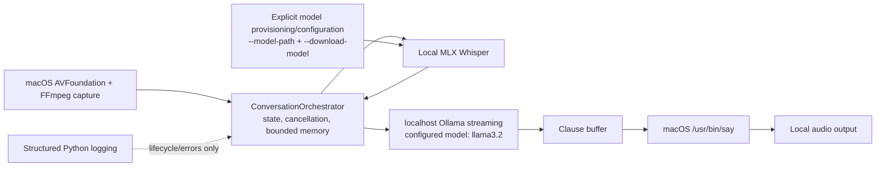
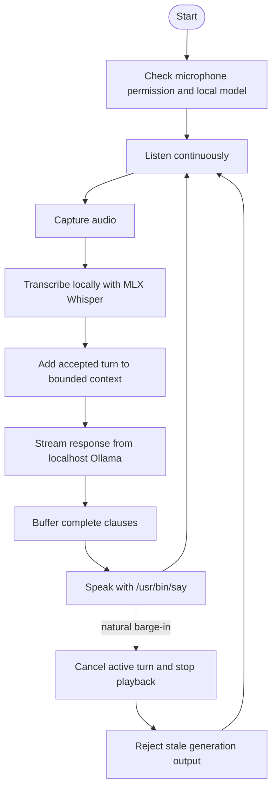

# Voice Command AI Assistant

Local-first voice-assistant runtime for macOS. Microphone capture, Whisper
transcription, conversation state, and speech playback are local. Ollama is
used only through its localhost API for language-model responses.

## Architecture



The runtime uses a generation-based cancellation token to reject stale model
and audio output after a barge-in. Conversation context is bounded by turn,
token, and byte limits. A clause buffer is the streaming boundary between
Ollama chunks and speech playback; applications embedding the orchestrator
should flush it at natural clause boundaries.

The token budget is deterministic and tokenizer-independent: each context
message costs `ceil(len(text) / 4)` tokens (Python character length), with the
oldest messages evicted until the configured budget is met. UTF-8 byte size is
enforced separately by `max_bytes`; this estimate is intentionally a bound for
memory management, not a claim about any model's tokenizer.

## Happy flow and interruption



## Prerequisites

- macOS with microphone permission available to the terminal/application.
- Python 3.11 or newer.
- FFmpeg with AVFoundation input support (`ffmpeg -devices`).
- Ollama installed and running locally when language-model responses are used.
- A local MLX Whisper model artifact. Model files are not downloaded silently.

The native player is `/usr/bin/say`; the runtime uses macOS audio primitives
and does not require a hosted speech service or a separate media player.

## Install

```bash
git clone https://github.com/mauricechesteraguda/voice-command-ai-assistant.git
cd voice-command-ai-assistant
python3 -m venv .venv
source .venv/bin/activate
python -m pip install --upgrade pip
python -m pip install -r requirements.txt
python -m pip install mlx-whisper
```

Install the macOS services separately, using your normal trusted installers.
For example, with Homebrew:

```bash
brew install ffmpeg ollama
```

## Models and configuration

The default Ollama model is `llama3.2`. Start Ollama and provision that model
explicitly:

```bash
ollama serve
ollama pull llama3.2
```

Whisper provisioning is also explicit. Place an MLX Whisper artifact at a
local path, then ask the CLI to verify/provision it with consent:

```bash
python assistant.py --model-path "$HOME/Models/whisper-base.en" --download-model
```

`--download-model` does not perform an implicit download: the current
provisioner checks that the supplied local artifact exists. Without
`--model-path`, the CLI refuses the provisioning command. Use `--model` to
select a model already available in Ollama:

```bash
python assistant.py --model llama3.2 --model-path "$HOME/Models/whisper-base.en"
```

## Run

With the virtual environment active, Ollama running, and a local Whisper
artifact configured:

```bash
python assistant.py --model llama3.2 --model-path "$HOME/Models/whisper-base.en"
```

The command enters the continuous capture/transcribe/stream/speak loop. The
capture monitor remains active during generation and playback, allowing a
barge-in to cancel and reap provider/player work and invalidate stale output.

Use `--verbose` for more structured runtime diagnostics. Stop the process with
`Ctrl-C`; SIGINT and SIGTERM perform runtime shutdown and cancel active work.

## Privacy and logging

Audio and transcription stay local by default. The only model service used by
the runtime is Ollama on `127.0.0.1`/`localhost`. Runtime logging uses Python's
structured logging for lifecycle, state, turn, external-call, cancellation, and
error events; it does not include audio, transcript, or model-response payloads.
Review
your application logging configuration before enabling additional handlers.

There are no silent model downloads. Model files must be supplied locally and
provisioning requires the explicit `--download-model` consent flag.

## Acoustic limitation

Playback is not full acoustic echo cancellation. Capture filtering suppresses
frames while playback is active, but room echo can still be transcribed on
some microphones. A headset is recommended, especially for barge-in testing.

## Troubleshooting

- **Microphone permission pending:** allow microphone access for the terminal
  or Python host in macOS System Settings, then restart the command.
- **Audio device unavailable:** verify `ffmpeg -devices` lists `avfoundation`
  and check the configured input device.
- **Whisper model missing:** pass `--model-path` to an existing local MLX
  Whisper artifact; the runtime will not fetch one for you.
- **Ollama unavailable:** start `ollama serve` and verify the configured model
  with `ollama list`.
- **Playback unavailable:** confirm that `/usr/bin/say` is present and that
  macOS audio output is available.
- **Stale or interrupted speech:** barge-in cancels the active generation;
  stale output is intentionally discarded. Retry the turn if needed.

## Tests

The deterministic suite contains 41 runtime contract tests and makes no
network, microphone, model, or speech calls:

```bash
source .venv/bin/activate
python -m pytest -x -q
python -m pytest -q
```

## License

This project is licensed under the [MIT License](LICENSE).
