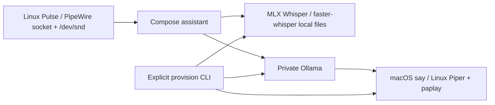
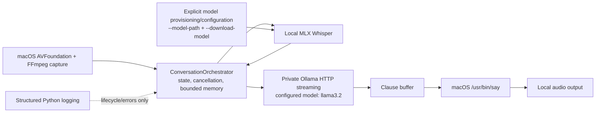
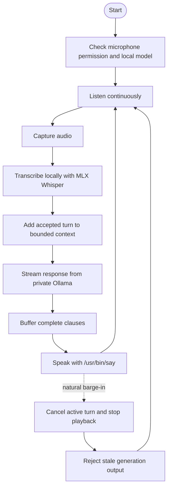

# Voice Command AI Assistant

Local-first voice-assistant runtime for macOS and Linux. Microphone capture, Whisper
transcription, conversation state, and speech playback are local. Ollama is
used only through its private API for language-model responses.

## Linux and container deployment

Linux uses FFmpeg Pulse input (including PipeWire's Pulse socket), local
`faster-whisper`, Piper WAV synthesis, `paplay`, and private Ollama. The CPU
Compose profile is the default; NVIDIA is an explicit override requiring the
NVIDIA Container Toolkit. Normal startup never downloads models.



Happy flow: validate dependencies → explicitly provision Whisper, Piper, and
Ollama → readiness check → capture → local transcription → private generation
→ clause playback → cancellation-safe stop. Provisioning validates
completeness/checksums and preserves the prior active artifact on partial
failure.

```bash
cp .env.example .env
docker compose config --quiet
docker compose build assistant
docker compose up assistant ollama
docker compose --profile provision run --rm provision
docker compose -f docker-compose.yml -f docker-compose.nvidia.yml config --quiet
```

Set `PULSE_SOCKET`, `PULSE_COOKIE`, `HOST_UID`, `HOST_GID`, and `AUDIO_GID` for
host audio access. The container always uses `/run/pulse/native` and
`/run/pulse/cookie`, regardless of host UID. The provision profile is the only
model-changing command and requires `--consent` internally; it validates
Whisper and Piper locally, then checks the selected Ollama model through the
private HTTP API.
Ollama has no public host port; Compose routes it as `http://ollama:11434`.

## Architecture



The runtime uses a generation-based cancellation token to reject stale model
and audio output after a barge-in. Conversation context is bounded by turn,
token, and byte limits. A clause buffer is the streaming boundary between
Ollama chunks and speech playback; applications embedding the orchestrator
should flush it at natural clause boundaries.

The token budget is deterministic and tokenizer-independent: each context
message costs `ceil(len(text) / 4)` tokens (Python character length), with the
oldest messages evicted until the configured budget is met. UTF-8 byte size is
enforced separately by `max_bytes`; this estimate is intentionally a bound for
memory management, not a claim about any model's tokenizer.

## Happy flow and interruption



## Prerequisites

- macOS with microphone permission, or Linux with a readable Pulse/PipeWire socket.
- Python 3.10 or newer.
- FFmpeg with AVFoundation input support (`ffmpeg -devices`).
- Ollama installed and running locally when language-model responses are used.
- A local MLX Whisper model artifact. Model files are not downloaded silently.

The native player is `/usr/bin/say`; the runtime uses macOS audio primitives
and does not require a hosted speech service or a separate media player.

## Install

```bash
git clone https://github.com/mauricechesteraguda/voice-command-ai-assistant.git
cd voice-command-ai-assistant
python3 -m venv .venv
source .venv/bin/activate
python -m pip install --upgrade pip
python -m pip install -r requirements.txt
python -m pip install mlx-whisper
```

Install the macOS services separately, using your normal trusted installers.
For example, with Homebrew:

```bash
brew install ffmpeg ollama
```

## Models and configuration

The default Ollama model is `llama3.2`. Start Ollama and provision that model
explicitly:

```bash
ollama serve
ollama pull llama3.2
```

Whisper provisioning is also explicit. Place an MLX Whisper artifact at a
local path, then ask the CLI to verify/provision it with consent:

```bash
python assistant.py --model-path "$HOME/Models/whisper-base.en" --download-model
```

`--download-model` does not perform an implicit download: the current
provisioner checks that the supplied local artifact exists. Without
`--model-path`, the CLI refuses the provisioning command. Use `--model` to
select a model already available in Ollama:

```bash
python assistant.py --model llama3.2 --model-path "$HOME/Models/whisper-base.en"
```

## Run

With the virtual environment active, Ollama running, and a local Whisper
artifact configured:

```bash
python assistant.py --model llama3.2 --model-path "$HOME/Models/whisper-base.en"
```

The command enters the continuous capture/transcribe/stream/speak loop. The
capture monitor remains active during generation and playback, allowing a
barge-in to cancel and reap provider/player work and invalidate stale output.

Use `--verbose` for more structured runtime diagnostics. Stop the process with
`Ctrl-C`; SIGINT and SIGTERM perform runtime shutdown and cancel active work.

## Privacy and logging

Audio and transcription stay local by default. The only model service used by
the runtime is Ollama on the configured private HTTP URL. Runtime logging uses Python's
structured logging for lifecycle, state, turn, external-call, cancellation, and
error events; it does not include audio, transcript, or model-response payloads.
Review
your application logging configuration before enabling additional handlers.

There are no silent model downloads. Model files must be supplied locally and
provisioning requires the explicit `--download-model` consent flag.

## Acoustic limitation

Playback is not full acoustic echo cancellation. Capture filtering suppresses
only typed echo-marked frames (or an explicitly configured detector), while
genuine speech remains eligible during playback. A headset is recommended,
especially for barge-in testing.

## Troubleshooting

- **Microphone permission pending:** allow microphone access for the terminal
  or Python host in macOS System Settings, then restart the command.
- **Audio device unavailable:** verify `ffmpeg -devices` lists `avfoundation`
  and check the configured input device.
- **Whisper model missing:** pass `--model-path` to an existing local MLX
  Whisper artifact; the runtime will not fetch one for you.
- **Ollama unavailable:** start the private Ollama service and verify readiness
  with the provision profile.
- **Playback unavailable (Linux):** confirm the Pulse/PipeWire socket and cookie
  paths, `AUDIO_GID`, `paplay`, and `piper`; inspect `docker compose logs`.
- **Offline recovery:** stop the stack, fix or replace the mounted artifacts,
  then run `docker compose --profile provision run --rm provision --offline`.
- **Rollback:** restore the previous model volume snapshot (or backup) and rerun
  the provision command; activation keeps the prior complete set on failure.
- **NVIDIA:** install NVIDIA Container Toolkit, then use
  `docker compose -f docker-compose.yml -f docker-compose.nvidia.yml up`.
- **Stale or interrupted speech:** barge-in cancels the active generation;
  stale output is intentionally discarded. Retry the turn if needed.

## Tests

The deterministic suite contains 81 runtime contract tests and makes no
network, microphone, model, or speech calls:

```bash
source .venv/bin/activate
python -m pytest -x -q
python -m pytest -q
```

## License

This project is licensed under the [MIT License](LICENSE).


## Contribution

This project is open for collaboration. If you wish to contribute:

    Fork the repository.
    Create a feature branch (git checkout -b feature/your-feature-name).
    Commit your changes (git commit -m 'Add your feature').
    Push to the branch (git push origin feature/your-feature-name).
    Open a pull request.

## Contact

For any questions or inquiries, please reach out to www.linkedin.com/in/agudatech/.

## Support

If you find this project helpful and would like to support its ongoing development, consider buying me a coffee! Your support helps me keep working on this project and developing more features.

[](https://www.buymeacoffee.com/mauriceague)
