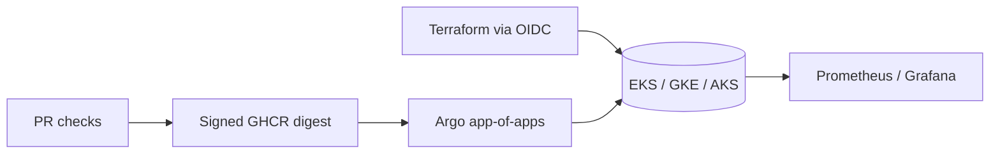

# Infrastructure operations

**Deployment status:** `Live environment: Not deployed`  
**Live URL placeholder:** `https://<environment>.<domain.example>` (placeholder only; no live URL exists).

Scope: local kind bootstrap, Terraform cloud profiles, Argo reconciliation, security evidence, observability, backups, and operator recovery. Raw audio, transcripts, prompts, and responses remain local. Start with `infrastructure/README.md`; operational runbooks are in `docs/runbooks/`.
