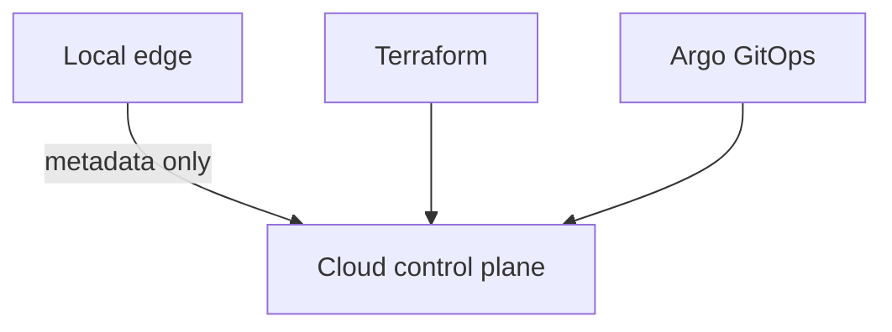

# Decision index

**Deployment status:** `Live environment: Not deployed`  
**Expected URL pattern:** `https://<environment>.<domain.example>` (placeholder).

Approved choices and tradeoffs are recorded in [ADR 0001](../../adr/0001-edge-control-plane-boundary.md), [ADR 0002](../../adr/0002-terraform-argo-ownership.md), and [ADR 0003](../../adr/0003-gitops-promotion-profiles.md). Terraform owns foundation; Argo owns workloads; immutable digests, OIDC, and optional observability are intentional.
