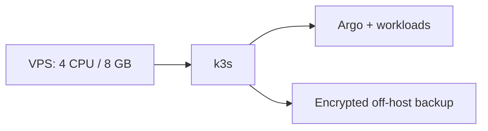

# k3s / VPS low-cost runbook

**Deployment status:** `Live environment: Not deployed`; expected URL `https://<environment>.<domain.example>` is a placeholder.

Provision a hardened supported Linux host, install a pinned k3s release, disable unauthorised public API access, apply network policy, configure OIDC/RBAC, cert-manager, and ExternalDNS, then bootstrap Argo. Test restore before production. This option trades managed upgrades and control-plane SLA for lower cost and operator-owned patching, monitoring, and backups. Never store static cloud credentials on the host.
