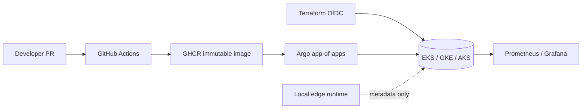

# Multicloud GitOps operations

**Deployment status:** `Live environment: Not deployed`  
**Live URL (placeholder):** `https://<environment>.<domain.example>` — placeholder only; no live endpoint is claimed.

This guide covers the Terraform-owned cloud foundation, Argo-owned workloads, local kind validation, and EKS/GKE/AKS profile placeholders. Conversation audio, transcripts, prompts, and responses remain in the edge runtime.



## Prerequisites and validation

Use Python 3.10, Docker, kind, kubectl, Helm, Terraform, and (for security scans) Trivy, Checkov, Gitleaks, Syft, and Cosign. A kind host should have **4 CPU and 8 GB RAM**. Do not create a cluster in CI validation unless the workflow explicitly runs it.

```bash
make validate
make kind-bootstrap
kubectl apply -f argocd/app-of-apps.yaml
```

Profiles are `kind`, `eks`, `gke`, `aks`, and optional low-cost `k3s`. Cloud bootstrap creates remote state and OIDC trust; plan/apply are manual, protected-environment operations with no static cloud credentials. DNS and TLS use ExternalDNS and cert-manager; replace domain placeholders only in an approved environment.

## Operations

Argo reconciles `argocd/app-of-apps.yaml`; Terraform does not mutate workload resources. Profiles carry provider, region, identity, database, and budget settings. Prometheus/Grafana provide SLOs and alerts; Loki and Tempo are optional and must not receive conversation content. Backups target RPO 24h and RTO 4h; cross-cloud logical restore is described in `docs/runbooks/cross-cloud-restore.md` and preserves the source backup on failure.

Access is via SSO/OIDC and least-privilege RBAC. Break-glass requires two operators, recorded approval, short-lived credentials, and immediate rotation. Teardown requires a recent backup and explicit Terraform approval. See `docs/runbooks/teardown.md` and `docs/infrastructure/decisions/README.md`.

## Cost and caveats

Estimates dated **2026-10-04** are ranges, not quotes: EKS $110–190/month plus PostgreSQL $20–100+; GKE $50–160 or Autopilot $30–180 plus PostgreSQL; AKS $80–190 plus PostgreSQL. Secure production posture can exceed $200/month. These are planning assumptions for one small region, modest traffic, and excluded egress/support fees. Cloud pricing and availability are **cloud-unverified** until a provider plan is executed.

See the [k3s runbook](../docs/infrastructure/k3s.md), [backup runbook](../docs/runbooks/backup-restore.md), and [official AWS](https://aws.amazon.com/eks/pricing/), [Google Cloud](https://cloud.google.com/kubernetes-engine/pricing), [Azure](https://azure.microsoft.com/pricing/details/aks/), and [GitHub OIDC](https://docs.github.com/actions/deployment/security-hardening-your-deployments/about-security-hardening-with-openid-connect) references.
