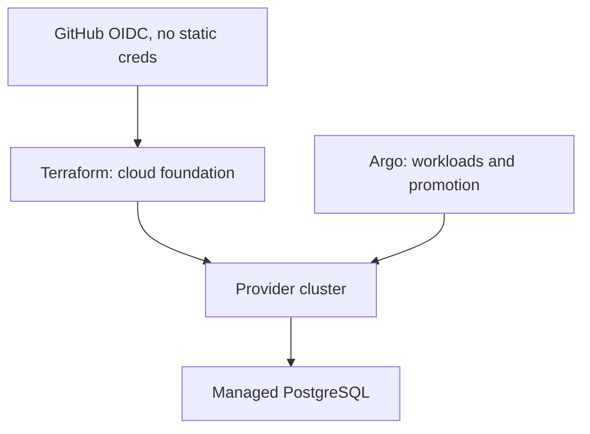

# Infrastructure decisions

**Deployment status:** `Live environment: Not deployed`
**Expected URL pattern:** `https://<environment>.<domain.example>` (placeholder; not live).

## Approved choices, alternatives, and tradeoffs

- Keep edge and cloud separate: preserves offline privacy and availability; a hosted conversation plane was rejected. See ADR 0001.
- Terraform owns network, cluster, PostgreSQL, DNS, vault, identity, bootstrap; Argo owns workloads, self-heal, promotion, and rollback. This avoids controller fights; manual kubectl ownership was rejected. See ADR 0002.
- Use immutable image digests and promotion PRs across explicit profiles. Tags alone were rejected because they are mutable. See ADR 0003.
- Use provider OIDC/workload identity and GitHub Actions OIDC. Long-lived static keys were rejected; setup is more involved and provider-unverified until applied.
- Use managed PostgreSQL for production, with k3s/VPS as the low-cost option. Managed service costs more but supplies operational controls; VPS costs less and increases backup/patch responsibility.
- Keep Prometheus/Grafana required and Loki/Tempo optional. Required logs/traces would increase cost and privacy exposure.
- Use kind for deterministic smoke validation, not production. It is inexpensive and reproducible but lacks managed control-plane guarantees.

The architecture is **not deployed**. Cloud profile values and costs are planning placeholders and require provider-specific review.

Links: [ADR 0001](../../docs/adr/0001-edge-control-plane-boundary.md), [ADR 0002](../../docs/adr/0002-terraform-argo-ownership.md), [ADR 0003](../../docs/adr/0003-gitops-promotion-profiles.md).
